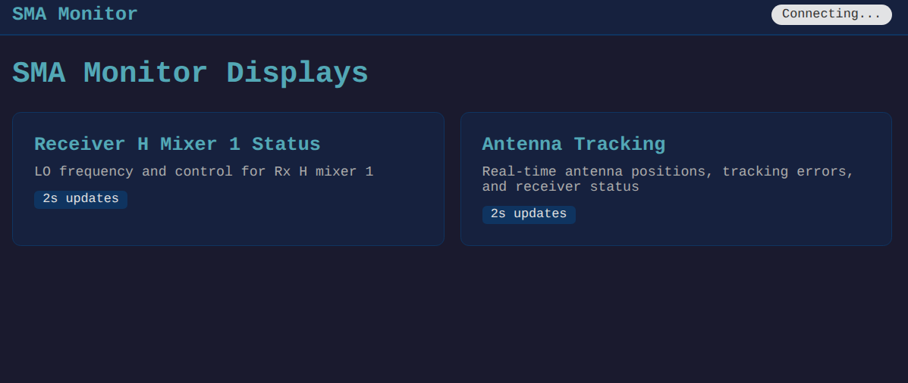

# SMA monitor, fault, alarm, and web display

.. include: webDESIGN.md

### Install

Assuming you have  python 3.11+ already installed.

```
     cd slama
     uv sync
     pip install -e .

```

### Run

1.  Start the server:
```
        uv run uvicorn slama.web.server:app --reload --port 8000
```

2.  Open your browser to ``localhost:8000``. You should see:

    

    Clicking on one of the tiles opens that monitor page.   "Connecting..." will change to "Connected."

3.  Run the observation simulation program. This will simulate a observation:  Flux calibrator, Bandpass cal, gain cal, source, gain cal, source, etc.
  
```
        cd src/slama 
        uv run fakeobs.py
```

4. You can change the default calibrators and integration time with command line arguments (*not fully tested*).  See
     
``` 
        uv run fakeobs.py --help
```


### Testing

Eventually there will be a pytest suite.  The test code in ``test`` is now outdated.
